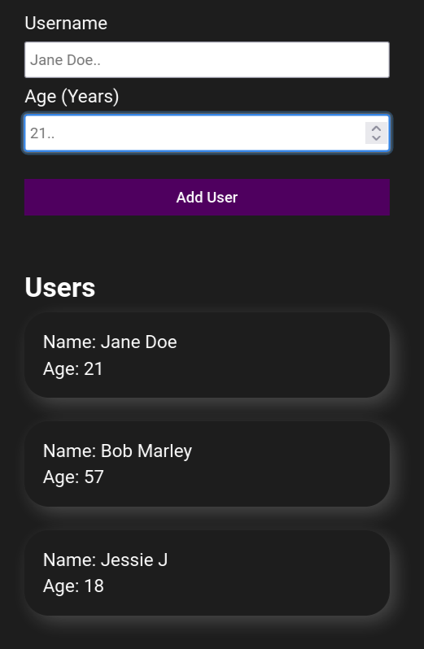

## DESCRIPTION:
- A simple "add user app" with a pop up error modal.

## OUTCOME:
- Practise React

## TECH STACKS:
- React,
- Hooks: useState.
- styling: CSS Module.

## PROGRESS:
- Done: 100%;

## How to run
`yarn install`
`yarn start`

## View other projects:
- [My Blog](https://hashnode.com/@marizoo)
- [My Pinterest](https://pin.it/16vGwjy)
- [My Youtube Channel](https://www.youtube.com/channel/UCfkbnM9WvHD3mjecBiGHCBQ/playlists)

## IMAGE:

